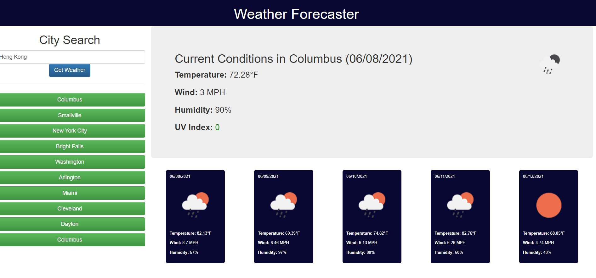

# Weather Forecaster



## About This Project

This is weather dashboard that shows the current conditions in the chosen city, as well as a brief five-day forecast with icons. It also saves previous searches so you can quickly recall forecasts for common locations.

## Built With

This webapp is built with Bootstrap, Moment.js, and Jquery.

## Installation and Usage

Clone the repository using the following command

```
git clone git@github.com:bear-evans/weather-forecaster.git
```

You may also view a live demo of the site [here](https://bear-evans.github.io/weather-forecaster/).
